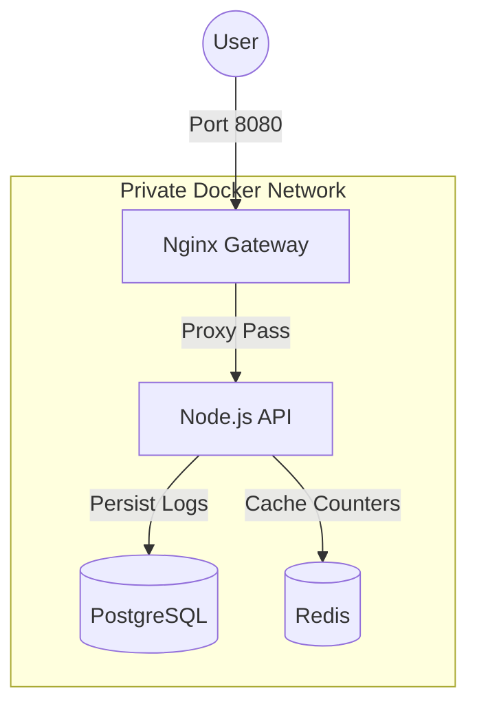

# APIShield

**APIShield** is a containerized infrastructure project demonstrating the **API Gateway pattern**. It isolates a Node.js backend behind an Nginx reverse proxy, ensuring that all traffic is filtered, rate-limited, and managed before reaching the application logic.

The architecture emphasizes **security boundaries**, **deployability**, and **infrastructure-as-code** using Docker Compose.

---

## 🏗 System Architecture

The system consists of four services running on a private Docker network (`internal-net`). The only public entry point is the Nginx Gateway.

Services
Gateway (Nginx):

Role: Reverse Proxy & Shield.

Features: Rate limiting (5 req/sec), Header sanitization, Health checks.

Port: Exposed on 8080.

Backend (Node.js/Express):

Role: Application logic.

Security: Not exposed to the host. Accessible only via Gateway.

Logic: Logs visits to Postgres, increments global counter in Redis.

Database (PostgreSQL):

Role: Persistent storage for access logs.

Volume: Data persists in pg-data volume.

Cache (Redis):

Role: High-speed global request counter.

Persistence: AOF enabled to survive restarts.

🚀 Getting Started
Prerequisites
Docker & Docker Compose

Installation
Clone the repo:

Bash

git clone [https://github.com/OUTLAWatlas/apishield.git](https://github.com/OUTLAWatlas/apishield.git)

cd apishield

Start the System:

Bash

docker-compose up --build -d

Verify Running Services:

Bash

docker-compose ps
🧪 Testing the Shield
1. Valid Request (Via Gateway)
Access the API through the public gateway.

Bash

curl http://localhost:8080/api/data
Expected Response:

JSON

{
  "message": "APIShield Protected Response",
  "data_sources": {
    "postgres_logs": 12,
    "redis_hits": 12
  }
}
2. Security Test (Direct Access)
Try to bypass the gateway and hit the backend port (3000) or DB port (5432).

Bash

curl http://localhost:3000/api/data
# Result: Connection Refused (Success! The backend is hidden)
3. Rate Limit Test
Spam the gateway to trigger Nginx protection.

Bash

for i in {1..20}; do curl -s -o /dev/null -w "%{http_code}\n" http://localhost:8080/api/data; done
Result: You will see 200 responses initially, followed by 503 Service Temporarily Unavailable once the rate limit is exceeded.

🔧 Technical Implementation
Networking: Uses a custom bridge network to isolate backend services.

Persistence: Docker Volumes for Postgres (pg-data) and Redis (redis-data).

Configuration: All services configured via Environment Variables in docker-compose.yml.
